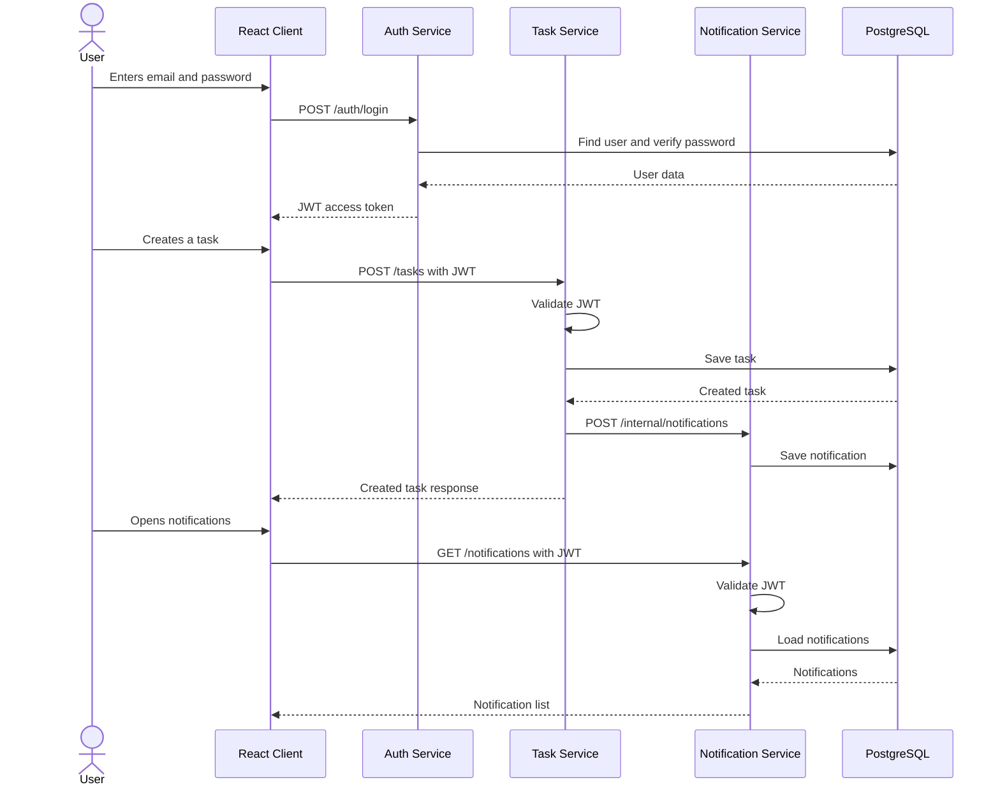

# Communication Diagram

```mermaid
sequenceDiagram
    actor User
    participant Client as React Client
    participant Auth as Auth Service
    participant Task as Task Service
    participant Notif as Notification Service
    participant DB as PostgreSQL

    User->>Client: Enters email and password
    Client->>Auth: POST /auth/login
    Auth->>DB: Find user and verify password
    DB-->>Auth: User data
    Auth-->>Client: JWT access token

    User->>Client: Creates a task
    Client->>Task: POST /tasks with JWT
    Task->>Task: Validate JWT
    Task->>DB: Save task
    DB-->>Task: Created task
    Task->>Notif: POST /internal/notifications
    Notif->>DB: Save notification
    Task-->>Client: Created task response

    User->>Client: Opens notifications
    Client->>Notif: GET /notifications with JWT
    Notif->>Notif: Validate JWT
    Notif->>DB: Load notifications
    DB-->>Notif: Notifications
    Notif-->>Client: Notification list
```
