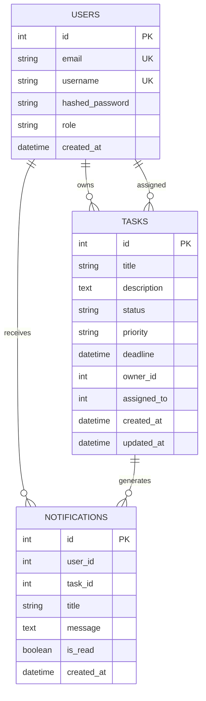

# Database Diagram

The project uses PostgreSQL as a relational database.

## Notes

The current implementation keeps service boundaries simple and stores identifiers such as `owner_id`, `assigned_to` and `user_id` as integer references. In a production system, this could be extended with stricter database-level foreign keys or separate databases per service.
